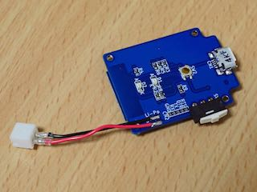

# THETA簡単リモコン

5秒でRICOH THETA Sと接続できる簡単リモコンの設計を公開しています。

[](https://www.youtube.com/watch?v=02DGiVLA_kg)

## 機能

- THETA Sのシャッターを切る
- THETA Sの動画撮影開始/停止
- Webブラウザで接続するTHETA Sを設定
- Webブラウザでファームウェアをアップデート
- USB充電

詳細は[操作説明](doc/instruction-manual.md)を御覧ください。

## プロジェクト構成

```
theta-remote-release/
  |-- hardware/       回路図・基板図 (KiCad)
  |-- src/            ファームウェア (Arduino)
  |-- platformio.ini  PlatformIOのプロジェクトファイル
```

## ハードウェア

回路図、プリント基板は[KiCad](http://kicad-pcb.org/)で設計しました。

`hardware/theta-remote-release.pro`をKiCadで開いてください。

- [回路図](hardware/theta-remote-release.sch.svg)
- [部品リスト](hardware/parts.md)

## ファームウェア

このプロジェクトはArduino ([PlatformIO](http://platformio.org/))を利用しています。

次の手順でファームをビルドしてリモコンに書き込めます。

1. PCのシリアルポートとリモコンのDEBUGコネクタを接続
2. リモコンの電源ON
3. 次のコマンドを実行

```
# もしPlatformIOがなければインストールする (Pythonが必要です)
$ pip install -U pip setuptools     
$ pip install -U platformio

# このリポジトリをCloneする
$ git clone https://github.com/shrhdk/theta-remote-release.git

# ビルドしてリモコン(ESP8266)にアップロードする
$ cd theta-remote-release
$ pio run --target upload
```

## 組み立て例

[](doc/overview.jpg)

- [基板表面](doc/front.jpg)
- [基板裏面](doc/back.jpg)

## License

- This project is released under the MIT license. (except `ESP8266HTTPClient.cpp`)

## 謝辞

このプロジェクトは以下のソフトウェア・資料を利用しています。

- [aJson](https://github.com/interactive-matter/aJson) Copyright (c) 2010, Interactive Matter, Marcus Nowotny
- [ゆるりとものづくり: ここであえてのESP-WROOM-02用変換基板](http://monomake.blogspot.jp/2015/08/esp-wroom-02.html)
